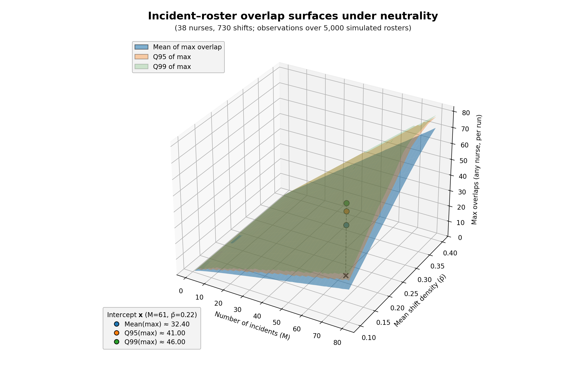

# Incident Pattern Simulator + Incident Overlap 3D Explorer
**The statistics of being in the wrong place at the wrong time**

*Beta Release*

Two complementary interactive tools exploring the statistical foundations of "incident overlap" evidence in healthcare settings. Built as a pedagogical resource to help lawyers, journalists, statisticians, and the public understand why a nurse present at many incidents isn't necessarily evidence of wrongdoing.

- **Incident Overlap 3D Explorer** (`incident_overlap_3D_explorer.html`) — null "landscape" overview (Mean/Q95/Q99) with traffic light comparison tool
- **Incident Pattern Simulator** (`Incident_Pattern_Simulator.html`) — detailed single-scenario analysis

## The Core Problem

When a nurse works more shifts than average, they will naturally be present at more incidents—simply because they were there more often. This simulator demonstrates that apparent "suspicious coincidence" often emerges from ordinary workload patterns, not wrongdoing.

## What This Tool Does

The simulator runs thousands of Monte Carlo trials where:
- Incidents are placed randomly across shifts
- Nurses' schedules are drawn from realistic workload distributions  
- Overlap counts reveal how often the hardest-working nurse appears "suspicious"

**Key insight:** The nurse who works the most will almost always have the highest overlap—regardless of guilt.

## Try It

**[Launch the Incident Overlap 3D Explorer](incident_overlap_3D_explorer.html)** — Explore the null overlap landscape (3D surfaces) and compare observed values with traffic light indicators

**[Launch the Incident Pattern Simulator](Incident_Pattern_Simulator.html)** — Explore individual scenarios

 

## Features

### Three Analysis Modes

| Mode | What It Tests |
|------|---------------|
| **Standard** | Is this specific nurse's overlap unusual given their workload? |
| **Selection Effect** | How does investigator bias inflate apparent coincidence? |
| **No Pre-designation** | What's the expected maximum overlap when nobody is pre-selected? |

### Statistical Framework

- **Hypergeometric distribution** for exact shift-based overlap
- **Beta-binomial workload model** with intuitive Mean/Consistency parameters
- **Monte Carlo confidence intervals** for key statistics
- **3D surfaces (“manifold”)** default 5,000 trials per (M, p̄) grid cell  
  *Efficiency note:* For efficiency, trials are generated per (p̄, trial) and reused across the incident axis via prefix sampling; this keeps the per-cell distributions unchanged.
- Ward staffing presets including parameters from O'Quigley (2025)

### Incident Overlap 3D Explorer (the "manifold")

Interactive 3D visualisation of how maximum incident overlap scales under the null hypothesis:

- **Three statistical surfaces:** Mean, Q95, Q99 percentiles across 5,000 Monte Carlo trials per grid point
- **Two-parameter exploration:** Number of incidents (M) vs mean shift density (p̄), with presence displayed as percentages
- **Real-time interpolation:** Drag the intercept marker to query any point on the surfaces
- **Grounded baselines:** What overlap counts are expected by chance alone?
- **Traffic light comparison:** Enter an observed overlap count to see a visual traffic light indicator (continuous):
  - 🟢→🟠 **Mean to Q95**: colour transitions smoothly from green (at Mean) to orange (at Q95)
  - 🟠→🔴 **Q95 to Q99**: colour transitions smoothly from orange (at Q95) to red (at Q99)
  - 🔴 **Above Q99**: fully red (beyond the 99th percentile)
  - When an observed value is entered, an additional marker appears in the 3D scene and an "Observed" entry is shown in the legend.
  - Observed is bounded by M (total incidents); values above M trigger a warning and are clamped to M for display.

Terminology note: the documentation mostly says “surfaces”; the export artefacts use “manifold”. Here, “manifold” just means the set of three surfaces (Mean/Q95/Q99) over the (M, p̄) grid.

The surface/manifold data can be regenerated using `incident_overlap_3D_generator.py` with custom parameters.

### Judicial Commentary

Side-by-side prosecution and defence framings of the same statistics, demonstrating:
- The prosecutor's fallacy (confusing P(evidence|innocence) with P(innocence|evidence))
- Why "present at 92% of incidents" means nothing without workload context
- The gap between mean outcomes and extreme peaks

## Important Limitations

⚠️ **Educational Purpose Only**

This simulator is a teaching aid, not a forensic instrument. The models use simplified assumptions (uniform incident distribution, exchangeable shift probabilities) that may not hold in specific cases.

**This tool must not be:**
- Submitted as evidence in court
- Used to argue guilt or innocence
- Applied to real case data without qualified expert oversight

Any application to live cases requires verification by a Chartered Statistician (CStat, RSS), Accredited Professional Statistician (PStat, ASA), or equivalent.

## Background Reading

- O'Quigley, J. (2025). "Use of roster charts in the investigation and prosecution of nurses suspected of inflicting deliberate harm on patients." *Medicine, Science and the Law*
- O'Quigley, J. (2025). "Suspected serial killers and unsuspected statistical blunders." *Medicine, Science and the Law*, 65: 28–35
- Meester et al. — On the (ab)use of statistics in medical-legal cases
- Thompson & Schumann — Interpretation of statistical evidence in criminal trials

## Documentation

Full technical documentation including mathematical framework, parameter explanations, and interpretation guidance is available in [Incident_Roster_Analysis.docx](Incident_Roster_Analysis.docx).

The surface generator source (`incident_overlap_3D_generator.py`) includes detailed inline documentation of the Monte Carlo methodology.

## Licence

MIT License — free to use, adapt, and share.

---

*"Someone will always be the maximum. Being the maximum isn't evidence of guilt."*
